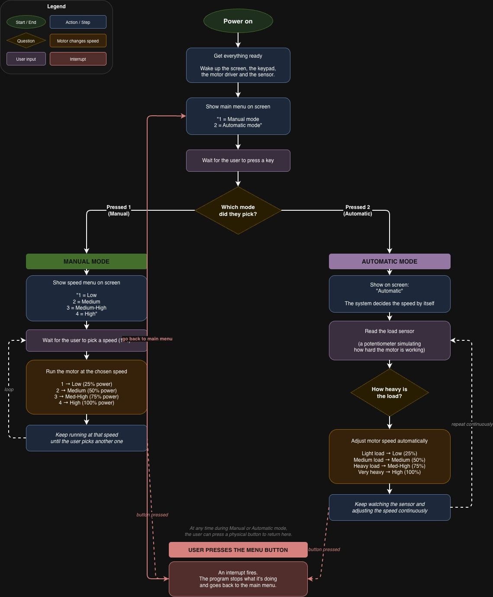

# Practice 6 — LCD, Keyboard and PWM Integration

**Microcontrollers Lab — Week 13**
**Board:** FRDM-KL25Z (MKL25Z4)

This practice integrates the modules seen during the course (LCD, 4x4 keypad, interrupts, ADC and PWM) into a single application that simulates a simple industrial grinder with two operating modes (Manual and Automatic).

---

## Files in this repo

| File | Description |
|------|-------------|
| `pwm_par1.c`   | Part 1 — Standalone PWM demo. Cycles a 60 Hz PWM signal through 0%, 25%, 50%, 75% and 100% duty cycle on `PTB18` (TPM2_CH0). |
| `prac3_pwm.c`  | Part 3 — Full integration: LCD + 4x4 keypad + PWM + ADC + external button interrupt. |
| `flow_diagram.drawio.xml` | Flow diagram of Part 3 (importable into [draw.io](https://app.diagrams.net)). |

---

## Hardware configuration

| Peripheral | Pin / Module | Notes |
|------------|--------------|-------|
| PWM output     | `PTB18` (TPM2_CH0, ALT3) | Drives LED / motor. 60 Hz, edge-aligned, high-true. |
| ADC input      | `PTB0`  (ADC0_SE8)       | Potentiometer simulating motor load (0–3 V). |
| LCD data (D4–D7) | `PTD0` – `PTD3`        | 4-bit interface. |
| LCD control    | `PTA2 (RS)`, `PTA4 (RW)`, `PTA5 (EN)` | |
| Keypad 4x4     | `PTC0` – `PTC7`          | Rows: PTC0–PTC3, Cols: PTC4–PTC7. |
| Mode button    | `PTA1`                   | Falling-edge IRQ, pull-up enabled. Returns to main menu. |

### Clocks / Timing
- **TPM2** clocked from MCGFLLCLK (`SIM_SOPT2 |= 0x01000000`) with prescaler `÷128`.
- **Modulo:** `MOD = 43702` → ~60 Hz PWM frequency.
- **Duty cycle values (CnV):**
  - 25% → `10925`
  - 50% → `21851`
  - 75% → `32776`
  - 100% → `43702`

---

## Part 1 — `pwm_par1.c`

Minimal example. The `main()` loop sweeps the PWM duty cycle in 25% steps with a 3 s delay between each step. Useful as a stand-alone test to confirm the TPM2 setup before integrating everything else.

**Register configuration** (key bits):
- `SIM_SCGC5 |= 0x400` — enables clock for PORTB.
- `SIM_SCGC6 |= 0x04000000` — enables clock for TPM2.
- `SIM_SOPT2 |= 0x01000000` — selects MCGFLLCLK as TPM source.
- `PORTB_PCR18 = 0x300` — MUX = ALT3 (TPM2_CH0).
- `TPM2_CnSC = 0x28` — edge-aligned, high-true PWM (`MSB:MSA = 10`, `ELSB:ELSA = 10`).
- `TPM2_SC = 0x0F` — CMOD = 01 (clock on), PS = 111 (prescaler ÷128).

---

## Part 3 — `prac3_pwm.c`

Full integration. The application starts by asking the user to choose between **Manual** and **Automatic** mode.

### Main menu
```
1:M  2:A
```

### Manual Mode (key `1`)
The LCD shows:
```
1L 2M 3MH 4H
```
The user picks a speed level on the keypad:

| Key | Level         | Duty Cycle | CnV   |
|-----|---------------|------------|-------|
| 1   | Low           | 25%        | 10925 |
| 2   | Medium        | 50%        | 21851 |
| 3   | Medium-High   | 75%        | 32776 |
| 4   | High          | 100%       | 43702 |

`set_duty(duty)` is called with the appropriate value as an argument — avoiding long `if` chains as required by the lab statement.

### Automatic Mode (key `2`)
The LCD shows `Automatic` and the program continuously reads the ADC connected to a potentiometer on `PTB0`. The duty cycle is selected from the ADC reading (12-bit, 0–4095):

| ADC range      | Voltage (approx) | Duty Cycle |
|----------------|------------------|------------|
| 0 – 929        | 0 – 0.75 V       | 25%        |
| 930 – 1859     | 0.76 – 1.5 V     | 50%        |
| 1860 – 2789    | 1.51 – 2.25 V    | 75%        |
| 2790 – 4095    | 2.26 – 3.0 V     | 100%       |

### Return-to-menu button
A push-button connected to `PTA1` triggers `PORTA_IRQHandler()`. The ISR clears the flag, applies a small debounce delay, and sets the global `estado = 1`, which causes the main loop to redraw the mode-selection menu.

---

## Function overview (`prac3_pwm.c`)

| Function | Purpose |
|----------|---------|
| `LCD_init()` / `LCD_command()` / `LCD_data()` / `LCD_nibble()` / `LCD_sendstring()` | 4-bit LCD driver. |
| `keypad_init()` / `keypad_getkey()` | 4x4 matrix scan; returns key code 1–16 (0 if none pressed). |
| `PWM_init()` | Configures TPM2_CH0 on PTB18 — 60 Hz, edge-aligned, high-true PWM. |
| `set_duty(duty)` | Writes the CnV value passed as argument. |
| `ADC_init()` / `ADC_read()` | ADC0 single-ended 12-bit conversion on channel 8 (`PTB0`). |
| `Init_Button()` | Configures `PTA1` as input with pull-up and falling-edge interrupt. |
| `PORTA_IRQHandler()` | Handles the menu-return button; sets `estado = 1`. |
| `delayMs()` / `delayUs()` | Software delays. |

---

## How to use

1. Flash the program to the FRDM-KL25Z.
2. The LCD shows `1:M 2:A`. Press **1** for Manual or **2** for Automatic.
3. **Manual:** press 1, 2, 3 or 4 to set the speed.
   **Automatic:** rotate the potentiometer; the speed updates automatically.
4. Press the `PTA1` button to return to the main menu.

---

## Diagrama de flujo



## Video

https://drive.google.com/file/d/1pww9xvJLFw4Y88nwSBJJvZwYYZQzSvQs/view?usp=sharing
